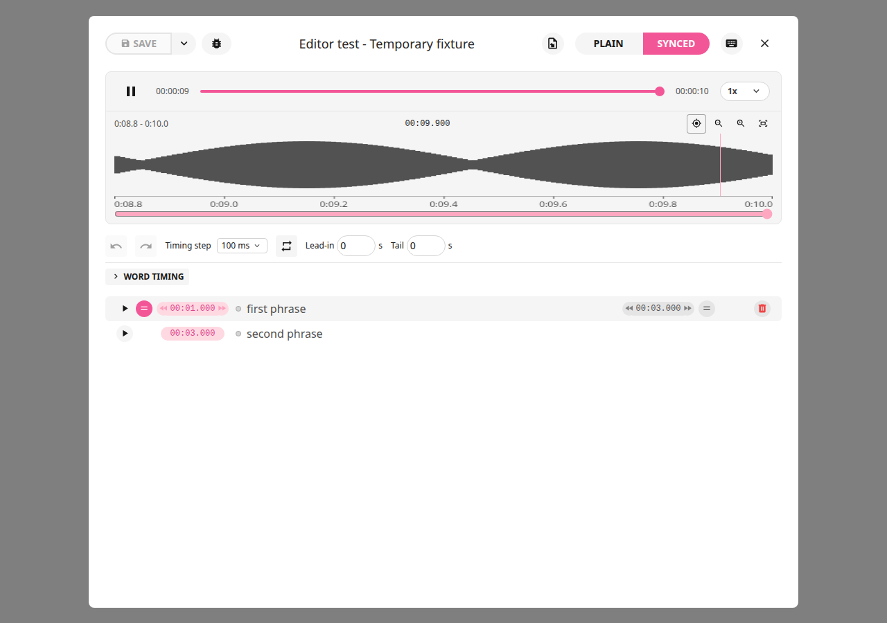

# LRCGET Documentation

Rick Lidgett's enhanced LRCGET, **2.2.0+local.20**.
An independent fork of the original project; original authors and license remain credited.

## Choose a Guide

| What You Want to Do                              | Guide                                                                                                  |
| ------------------------------------------------ | ------------------------------------------------------------------------------------------------------ |
| Understand the app, enhancements and limitations | [Illustrated overview](app-overview.md)                                                                |
| Start with a recording and plain lyrics          | [Step-by-step how-tos](how-to.md#create-timed-lyrics-from-a-text-file)                                 |
| Edit an existing LRC or timestamped TXT          | [Edit existing lyrics](how-to.md#edit-an-existing-lrc-or-timed-text-file)                              |
| Zoom, place markers and preview a phrase         | [Waveform and marker workflow](how-to.md#place-precise-markers-and-preview-before-confirming)          |
| Edit individual words                            | [Word timing and spelling](how-to.md#edit-individual-words)                                            |
| Save, export, embed or publish                   | [Output workflows](how-to.md#save-and-export-for-playback)                                             |
| Find keyboard shortcuts and detailed behavior    | [Complete editing reference](editing-guide.md)                                                         |
| See what Rick changed in the source              | [Modification overview](app-overview.md#modification-map) and [technical history](../LOCAL_CHANGES.md) |
| Install the current Linux build                  | [Installation](how-to.md#install-or-upgrade)                                                           |
| Understand the latest fixes and test results     | [Release notes](releases/2.2.0-local.20.md)                                                            |

## At a Glance

LRCGET finds lyrics through LRCLIB and helps you manually synchronize them to
your recording. This fork adds waveform navigation, preview-and-confirm markers,
word editing, improved embedding, refresh controls and saved modification dates.
It does not automatically identify singing, run Whisper/Demucs, or guarantee
perfect synchronization or lyric display on every player.

Screenshots were recaptured from .20 with temporary fixture lyrics and waveform data.
The guides describe the current build; historical release notes describe their
own versions, including behavior since changed.
