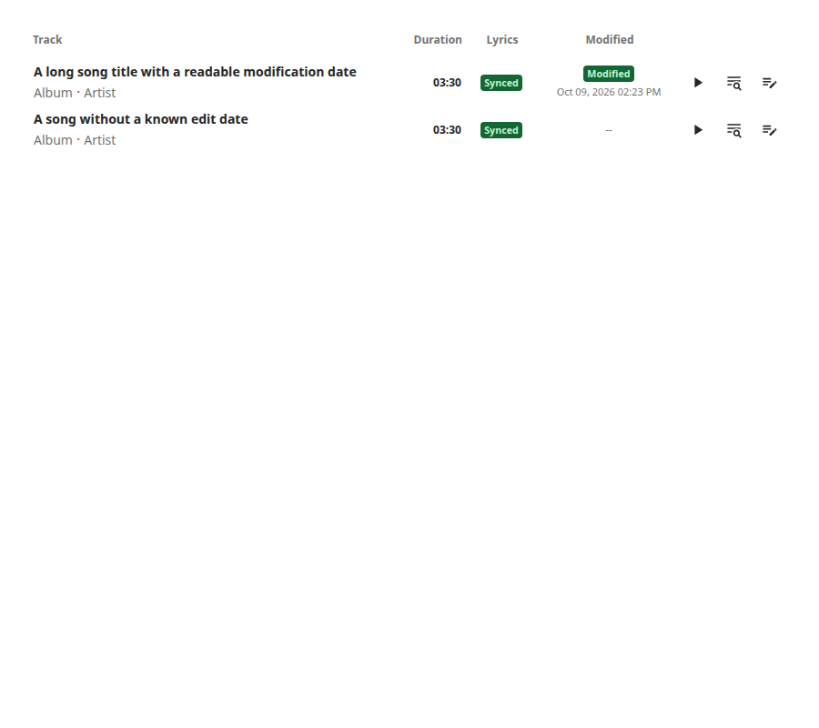
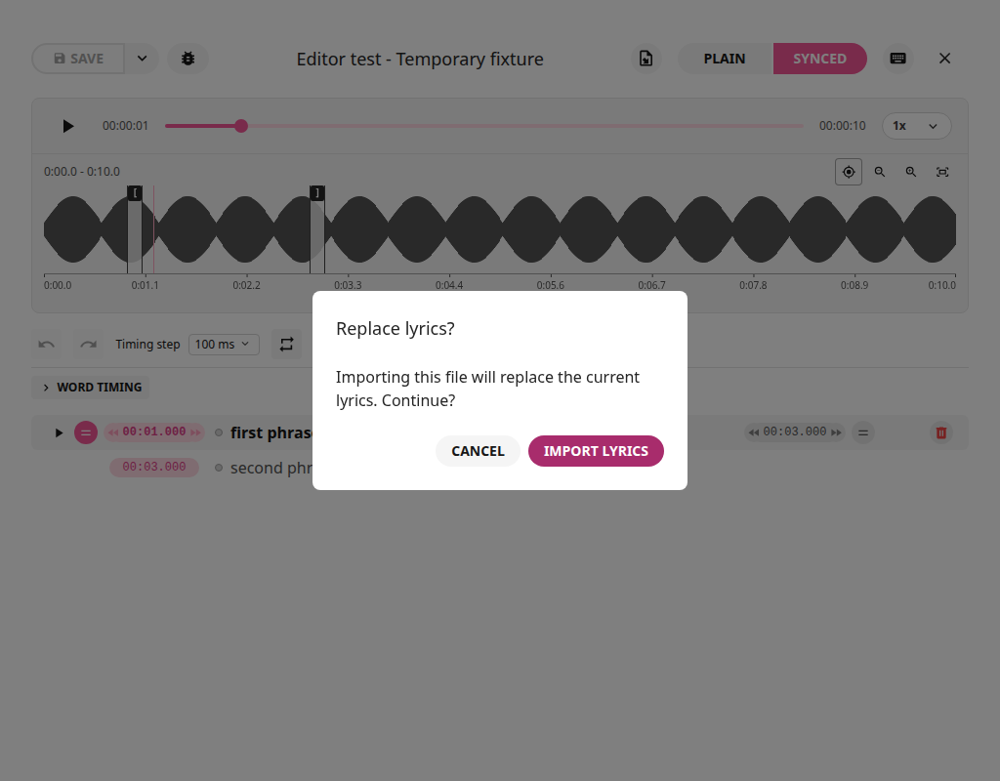
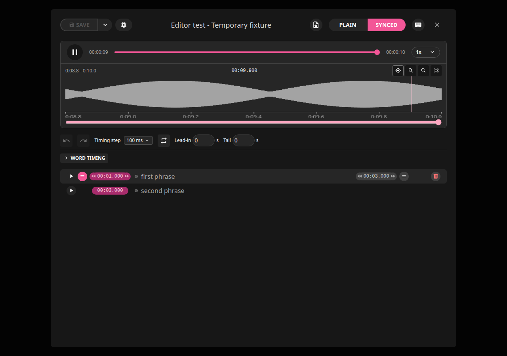

# App Overview and Modifications

**Version:** 2.2.0+local.20. **Editing developer:** Rick Lidgett
([@scriptusscript777](https://github.com/scriptusscript777)).
This is an independent LRCGET fork, not an official upstream release.
The original project retains its credits and license.

[Documentation home](README.md) | [Practical how-tos](how-to.md) | [Detailed reference](editing-guide.md)

## What the App Does

LRCGET scans your music directories and searches LRCLIB for plain or timed
lyrics. Its editor lets you correct wording and manually place line/word
timestamps against the actual recording. Save retains the editor document;
export writes local files or supported audio tags; publish shares lyrics online.

The enhanced editor keeps basic line editing visible and puts individual-word
tools in a collapsible **Word timing** section. Light and dark themes cover
timing controls, waveform navigation and export options.

## Library and Modified Dates

- Opening an initialized library runs an incremental scan. **F5** and the
  library's **Refresh library (F5)** action discover added/removed recordings.
- The **Modified** column sits after Lyrics and before action buttons. Its
  green badge shows the last explicit editor-save date/time in the PC's timezone.
- Opening a track or saving without changes does not create a modification date.
  A downloaded/imported lyric is not a human edit until explicitly saved in the editor.
- Dates survive embedding, restart and refresh. Scans keep the same track record
  when tag exports change an audio file's fingerprint at the same path.
- Matching dates orphaned by older scans can be recovered without replacing
  current lyric content. Ambiguous matches are left alone; unknown dates show `--`.
- Removing a recording removes its library row on refresh. Existing preservation
  of orphaned lyric documents is separate from the visible library listing.

## Inputs and Working Documents

| Input                       | How It Is Used                                                                                |
| --------------------------- | --------------------------------------------------------------------------------------------- |
| Untimed `.txt`              | Imported as plain text and untimed rows; you assign timestamps                                |
| Line-timed `.txt` or `.lrc` | Existing line timestamps become editable rows                                                 |
| LRCLIB result               | Select the matching recording; plain results still need timing                                |
| Genius or another website   | Copy sung lyrics into Plain or a TXT file; arbitrary URLs are not scraped                     |
| Embedded audio lyrics       | Supported by the library import/embedding workflow; explicit file import loads external edits |

Import replacement requires confirmation. It changes the working document,
not the source file. Plain and Synced are separate working versions: editing
synced wording does not silently rewrite your Plain text or original TXT.
File import is replacement, not automatic merging of two lyric versions.

Line-level timestamp formats include `[mm:ss.xx]` and milliseconds. Enhanced
inline word-tag LRC and nonzero offset headers need conversion to explicit
line timestamps before file import. Mixed timed/untimed files are rejected.

## Waveform, Zoom and Markers

- The waveform shows the whole mix, not a separated singer. It is decoded and
  cached; normal zooming/playback does not repeatedly analyze the recording.
- Click to seek. Use zoom buttons or repeated double-clicks for magnification.
  Wheel/trackpad gestures and the bottom pan control reach off-screen regions.
- **Follow waveform playback** keeps the playhead visible at the selected zoom,
  with Loop on or off. Zoom preserves Follow. Manual panning holds the inspected
  region; pause/play or the Follow button resumes automatic navigation.
- An explicit Follow-off choice remains off across zoom and playback restarts.
- The clock displays `mm:ss.mmm`, but player updates are approximately every
  40 ms. Display precision is not a promise of millisecond playback accuracy.
- Start/end handles each use one vertical guide and separate upper/lower hit
  areas, so close markers remain selectable.
- Dragging/nudging creates a preview, not a saved edit. **Apply Markers** commits
  both boundaries as one undoable edit. **Cancel** discards the preview.

## Loops and Playback

**Loop selected phrase** repeats the selected range. Lead-in and Tail add audition
context; both default to zero for exact marker-to-marker repetition. Released
marker previews become the audition range before confirmation. Dragging does
not continuously reseek. Apply commits timestamps; Cancel restores saved bounds.

Normal playback can pass the end marker. A sentence's Play button selects that
phrase and plays forward, turning Loop off. Changing lyric selection also turns
Loop off. Timing-edit auditions can retain an active loop.

## Lines and Individual Words

Line starts/ends can be synchronized to playback, entered or nudged. Timing steps
include 10/25/50/100 ms. Undo/Redo operates on synced edits during the session.
Untimed text has no confirmed markers until a start is set; its provisional end
is labeled **Inferred end** until you confirm one.

**Follow Lyrics** is different from waveform Follow: it advances the selected
lyric/word boxes and marker targets, without rewriting timestamps. Manual
selection, loops, word editing and marker previews hold the selected target.

Word tools support separate lane zoom, boundary dragging, synchronization to
playback, and spelling correction through **Edit word**, F2 or right-click.
Spelling edits preserve timing/whitespace; structural split/merge is explicit.
Moving the first word's start can move its sentence start; later words do not
automatically shift an unchanged sentence start.

## Save, Export and Publish

| Action                 | Destination                                    | Shared Online? |
| ---------------------- | ---------------------------------------------- | -------------- |
| Save                   | LRCGET's local lyric document                  | No             |
| Save and export: TXT   | Plain sidecar beside the recording             | No             |
| Save and export: LRC   | Timed sidecar beside the recording             | No             |
| Save and export: Embed | Supported MP3/FLAC metadata                    | No             |
| Save and Publish       | Configured LRCLIB instance, after confirmation | Yes            |

LRC export is initially selected in the editor. Embedding requires the experimental
setting and a supported file. MP3 output uses ID3v2.4 UTF-8 USLT/SYLT; timed
entries use milliseconds. Audio is not re-encoded. FLAC uses its metadata fields.
Embedding is not guaranteed to display in older cars, Windows players or every
Jellyfin client. Keep an LRC sidecar when useful for your playback software.

TXT and LRC exports coexist. Selecting a format can replace its existing
destination; leaving TXT unchecked protects an existing TXT from that export.
Unconfirmed waveform previews are not exported. Apply them first.

Exports stage/check output and then replace the destination atomically. Failed
preparation leaves the original intact. Since .20, successful exports create no
rolling `.bak` files and clean the exact destination's old `.lrcget.bak`, when
removal is permitted. Unrelated backups are untouched. Keep separate backups
if you need version history. Failure for one target can leave other targets
successfully exported; inspect the result before retrying.

## Modification Map

| Enhancement         | What Changed                                                                                      | Reference                                                                      |
| ------------------- | ------------------------------------------------------------------------------------------------- | ------------------------------------------------------------------------------ |
| Embedded lyrics     | Optional MP3/FLAC export, replacement of older lyric variants, metadata/audio preservation checks | [Export reference](editing-guide.md#save-export-and-publish)                   |
| File import         | Plain TXT, timestamped TXT and LRC with confirmation and source protection                        | [Import how-to](how-to.md#create-timed-lyrics-from-a-text-file)                |
| Timing editor       | Line/word tools, steps, contextual playback, keyboard handling and session undo                   | [Editing reference](editing-guide.md#edit-lines-and-text)                      |
| Waveform navigation | Cached peaks, seek, zoom, pan and playback following                                              | [Waveform how-to](how-to.md#zoom-and-follow-without-looping)                   |
| Marker confirmation | Preview, audition, Apply/Cancel and fixed saved timestamps                                        | [Marker how-to](how-to.md#place-precise-markers-and-preview-before-confirming) |
| Word editing        | Follow Lyrics, spelling edits, split/merge and independent lane zoom                              | [Word how-to](how-to.md#edit-individual-words)                                 |
| Looping             | Selected-range loops, preview bounds, cancellation and explicit forward playback                  | [Loop how-to](how-to.md#loop-between-the-markers)                              |
| Help and themes     | Native hover descriptions without blocking popup panels; light/dark controls                      | [Detailed limits](editing-guide.md#themes-diagnostics-and-limits)              |
| Refresh             | Startup scanning and F5 with unavailable-directory safeguards                                     | [Library reference](editing-guide.md#library-search-and-refresh)               |
| Modified column     | Explicit save date, responsive columns, persisted track identity                                  | [Modified column](editing-guide.md#modified-column)                            |
| Safe exports        | Staging, failed-save protection and successful-save backup cleanup                                | [Safe saving](editing-guide.md#safe-saving)                                    |

For implementation notes and version-by-version changes, read
[LOCAL_CHANGES](../LOCAL_CHANGES.md) and the [release notes](releases/2.2.0-local.20.md).
Screenshots use demonstration fixtures, not personal recordings. Some screenshots
were captured when their feature was introduced; current text describes .20.

## Scope and Verification

This fork's distributed/tested package is Linux amd64. Historical upstream
Windows/macOS download links are not installers for these modifications.
LRCGET is not musicprocessor/musicdiscovery and does not include their PDF,
YouTube-download, Whisper, WhisperX or Demucs pipelines.

The .20 code run passed 369 frontend and 52 Rust tests, with one optional fixture
test ignored, plus browser and isolated native checks. ESLint had no errors and
74 existing warnings; Ruff reported 11 existing findings in the unchanged Python
test-data generator. Those are test results, not guarantees of perfect lyrics.
