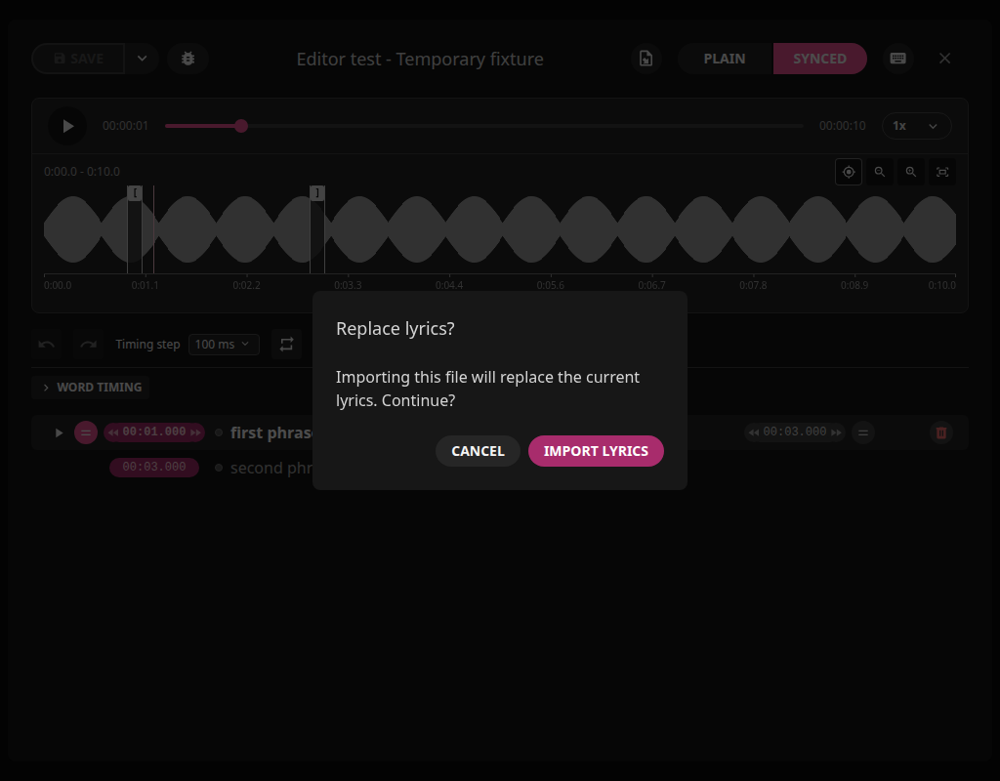

# Creating and Editing Timed Lyrics

Rick Lidgett's enhanced LRCGET build, `2.2.0+local.11`.
Original project authors and license remain credited.

## Start With Lyrics and a Recording

- **Plain text file:** click the header **Import lyrics file** icon and choose
  a `.txt` file, one sung phrase per line. It creates untimed synced rows for
  you to time against the recording; it does not invent timestamps.
- **Online lyrics:** use LRCGET's built-in LRCLIB search. A synced result already
  has timestamps; a plain result needs manual timing.
- **Genius or another website:** copy the lyrics into **Plain**. Arbitrary website
  URLs are not imported or scraped by LRCGET.
- **Existing LRC or timestamped TXT:** use the same **Import lyrics file**
  action. Line timestamps are detected automatically, including `[mm:ss.xx]`
  and millisecond precision. Existing times become editable synced rows.
  **Paste LRC content** remains available in the empty Synced editor.

Import asks before replacing existing words/timings. Cancel leaves them intact.
Import does not rewrite your source TXT or LRC file. Save/export is a separate action.
Empty, malformed and mixed timed/untimed files are rejected without discarding
words. This import supports line-level LRC; enhanced inline word tags and nonzero
offset headers need to be converted to explicit line timestamps first.

You need the corresponding audio recording to listen and set timings. LRCGET
does not run Whisper/Demucs or automatically align plain text to singing.

## Create a Timeline

1. Import a plain text file using the header icon, or paste your words into **Plain**.
2. File import opens untimed **Synced** rows. For pasted plain text, open **Synced**
   and select **Import from plain lyrics** when it is empty.
3. Play the recording, select a line and press **Space** when its singing starts.
4. Press **Shift+Space** when that line finishes. Select the next line and repeat.
5. Replay and refine with phrase looping, waveform markers and timing steps.

These are default shortcuts; customized bindings appear in the keyboard menu.
Use the synced editor rather than typing in a text field when invoking shortcuts.

## Zoom and Precision

Double-click a point on the waveform to magnify it. Repeat to go deeper, then
drag or nudge the selected lyric's start/end markers and use Apply Markers.
A single click still seeks. Double-click inspection temporarily holds the view
instead of following playback; pause/play or the Follow button resumes following.
The minus and Fit controls zoom back out. Marker timestamps never move with zoom.

Magnification keeps a visible selected phrase marker in view, rather than
anchoring to an unrelated playhead. Zoom preserves the playback-follow setting;
when following is enabled, the view advances with the moving playhead.
At high magnification, a phrase can span more than one
window; scroll to reach its other marker.

Use a horizontal trackpad gesture, mouse wheel over the waveform or the bottom
pan control. Manual panning disables follow, so playing audio does not pull
your view away. Pause and play again to resume following after manual inspection,
or use the crosshair follow button. If you explicitly turn that button off,
it stays off until you turn it on. Marker timestamps stay fixed through zoom,
scrolling and playback, including after an edit; only deliberate timing edits
move them.

Drag the start/end markers, or focus a marker and use Left/Right with the
selected 10/25/50/100 ms timing step. Shift multiplies a marker nudge by ten.
Dragging or nudging a marker stages a preview. Click **Apply Markers** when
both boundaries are ready; they become one undoable document edit. **Cancel**
discards the pending pair. Escape during a drag discards that drag; outside a
drag it discards the pending preview. Switching phrases or closing the editor
also discards unconfirmed previews.

Start-marker changes shift that line's word timings while holding its preview
end fixed. End-marker changes cannot truncate timed words. Playback, zoom and
scrolling leave both preview and committed recording timestamps unchanged.
Save/export uses the confirmed lyric document: apply your markers first.

Expand **Word timing** only when individual-word timing is needed. Its 1-8x
zoom and horizontal scrolling are separate from waveform zoom.

## Save, Export and Publish

Save retains the editor's changes. Use **Export** with **Synced lyrics (.lrc)**
selected to write a playback sidecar. Select embedded lyrics too if desired;
that option requires experimental embedding enabled and a supported audio file.
Embedding/exporting writes the track or sidecar; waveform navigation does not.

**Publish** sends lyrics to LRCLIB, with confirmation. Local saving/exporting
does not itself publish your lyrics. Player support for lyric display varies.

## Current Views

The preview timestamps above the waveform differ from the unchanged lyric-row
timestamps. Apply Markers confirms both; Cancel restores the original pair.

Screenshots use temporary fixture lyrics and mocked waveform data, not private
music. A waveform shows the full mix; it is not proof of exact singer alignment.
