# Creating and Editing Timed Lyrics

Rick Lidgett's enhanced LRCGET build, `2.2.0+local.20`.
Original project authors and license remain credited.

[Illustrated overview](app-overview.md) | [Step-by-step how-tos](how-to.md) | [Documentation index](README.md)

## Quick Workflow

1. Open your music library and select the recording you want to edit.
2. Open its lyrics editor. Import TXT/LRC or use the online lyrics search.
3. Use **Synced** to listen, set line starts/ends and refine markers.
4. Preview each change, use **Apply Markers**, then **Save**.
5. Open the arrow beside Save and choose **Synced lyrics (.lrc)**, then
   **Save and export**. Choose embedding separately if you want it.

Do not select **Save and Publish** unless you want to upload lyrics to LRCLIB.

## Library, Search and Refresh

Add your music directory through the library controls, then let the scan finish.
Search LRCLIB for the selected recording, checking artist, title and duration
before choosing a result. A different recording/version may have different timing.
Bulk lyric downloading and manual editing are separate workflows: review a
downloaded timeline against your recording before relying on its timing.

Opening LRCGET scans the initialized library incrementally. Close editing dialogs,
then press **F5** or use **Refresh library (F5)** to scan after adding/removing files.
An active scan cannot be started again. Refresh does not publish/export lyrics,
and it does not automatically overwrite database-owned lyrics with external edits.
To load an LRC you edited in another application, explicitly import that file.

### Modified Column

Track, album and artist lists show **Modified** between Lyrics and the action
buttons. A green badge and local date/time record your last lyric save in
LRCGET. The date updates only after a successful editor save, not when you
merely open a song, download lyrics or refresh the library. Unsaved edits do
not change it. Imports become recorded edits when you save them in the editor.

The database keeps this date through app restarts, F5 and rescans. Removing the
song from its directory removes its library row on the next refresh. Existing
orphaned lyric preservation still applies if a removed song is later re-added.
Older edits with no recorded date show `--`; this version cannot infer when
they were edited. File-system modification dates are not used as lyric-edit dates.

Normal and maximized windows share aligned columns. In a very narrow window,
scroll horizontally to see the date and action buttons.

## Start With Lyrics and a Recording

- **Plain text file:** click the header **Import lyrics file** icon and choose
  a `.txt` file, one sung phrase per line. It creates untimed synced rows for
  you to time against the recording; it does not invent timestamps.
- **Online lyrics:** use LRCGET's built-in LRCLIB search. A synced result already
  has timestamps; a plain result needs manual timing.
- **Genius or another website:** copy the lyrics into **Plain**. Arbitrary website
  URLs are not imported or scraped by LRCGET.
- **Existing LRC or timestamped TXT:** use the same **Import lyrics file**
  action. Line timestamps are detected automatically, including `[mm:ss.xx]`
  and millisecond precision. Existing times become editable synced rows.
  **Paste LRC content** remains available in the empty Synced editor.

Import asks before replacing existing words/timings. Cancel leaves them intact.
Import does not rewrite your source TXT or LRC file. Save/export is a separate action.
Empty, malformed and mixed timed/untimed files are rejected without discarding
words. This import supports line-level LRC; enhanced inline word tags and nonzero
offset headers need to be converted to explicit line timestamps first.

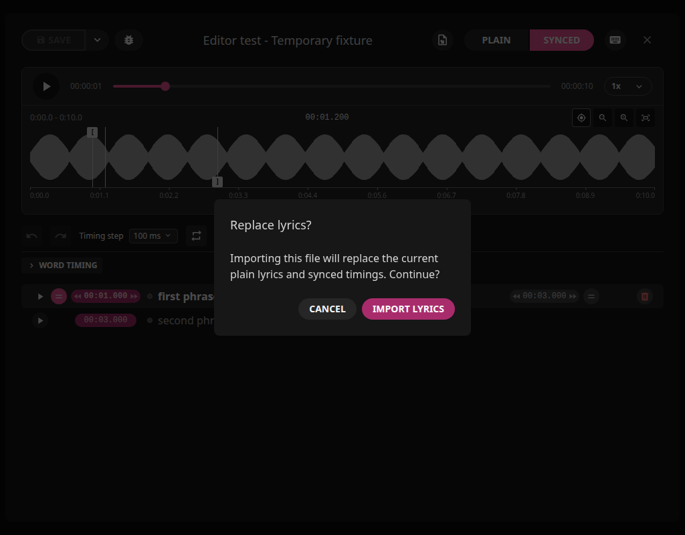

You need the corresponding audio recording to listen and set timings. LRCGET
does not run Whisper/Demucs or automatically align plain text to singing.

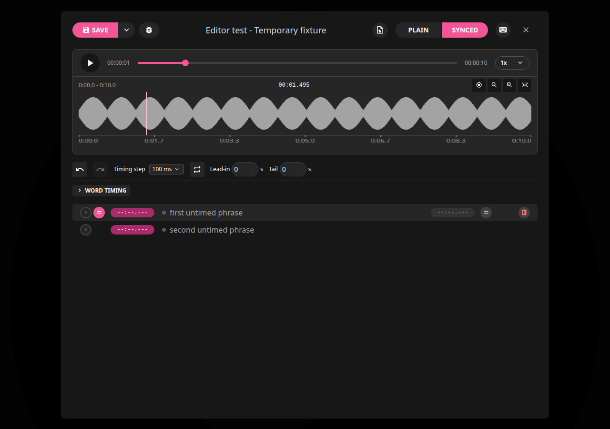

## Create a Timeline

1. Import a plain text file using the header icon, or paste your words into **Plain**.
2. File import opens untimed **Synced** rows. For pasted plain text, open **Synced**
   and select **Import from plain lyrics** when it is empty.
3. Play the recording, select a line and press **Space** when its singing starts.
4. Press **Shift+Space** when that line finishes. Select the next line and repeat.
5. Replay and refine with phrase looping, waveform markers and timing steps.

These are default shortcuts; customized bindings appear in the keyboard menu.
Use the synced editor rather than typing in a text field when invoking shortcuts.

## Edit Lines and Text

Use **Plain** for wording without timestamps and **Synced** for timed rows.
Select a synced row, then double-click its text to edit its phrase or adjust its start/end. The plus buttons
insert before, between or after rows; delete deliberately removes the selected row.
The selection toolbar can shift or delete multiple selected rows.
Use Undo/Redo to recover a synced edit while the editor session remains open.
Unsaved edits require confirmation when closing.

Importing a file replaces the editor's plain and synced working content only
after you confirm. It is not a merge of two lyric versions. Keep your original
TXT when importing a separate LRC; neither source is rewritten by import.
Exporting TXT or LRC can replace an existing destination of that same type.

| Default Key | Synced Editor Action |
| --- | --- |
| Up / Down | Select previous / next line |
| Space | Set selected line start at playback position |
| Shift+Space | Set selected line end at playback position |
| N | Set end and advance to next line |
| Enter | Set start, set previous line end and advance |
| Shift+Enter | Set start and advance without changing previous end |
| Left / Right | Shift line by the chosen timing step and replay |
| Shift+Left / Shift+Right | Adjust line end by the chosen timing step |
| P / Shift+P | Replay selected / previous line |
| Backspace | Delete selected line |
| Ctrl+Z / Ctrl+Shift+Z | Undo / redo synced edits |
| Ctrl+S | Save the editor document |

Marker focus uses Left/Right to nudge that marker instead of shifting a lyric
row. Text input and active tools have their own keyboard behavior. Open the
keyboard icon to see current bindings, configure replacements or reset them;
resolve any highlighted duplicate shortcuts.

## Playback and Phrase Loops

Use the editor's playback controls to play/pause, seek and adjust playback speed. Slower
playback can help locate consonants or long held notes; saved timestamps remain
positions in the original recording, not the slowed playback clock.

Select a timed line and enable **Loop selected phrase**. **Lead-in** and **Tail**
add listening context around that phrase without changing its lyric timestamps.
Both context values default to zero: the loop is exactly between the two markers.
Released/nudged marker previews are used immediately for auditioning; dragging
does not continuously reseek the player. Apply confirms them; Cancel returns the
loop to the saved document boundaries. Changing selected lines turns looping off.
Turn looping off when you want to continue through the whole song.
Changing recordings or closing the editor cancels a pending loop start. A player
failure stops looping and displays an error rather than repeatedly seeking.
The word lane and lyric rows show committed timings until Apply: auditioning a
marker preview is not a save, and changing markers does not rewrite lyric words.

## Zoom and Precision

Hover an editing control to see its standard description. The browser controls
the delay. Editing help creates no popup panels or overlays to block clicks.
The waveform shows
the playhead position as `mm:ss.mmm`; the player reports updates every 40 ms,
so three decimal places do not imply 1 ms playback accuracy.
Each marker uses a single vertical guide. The start handle is at the top and
the end handle at the bottom, making close boundaries separately selectable.
Resyncing a start outside the zoomed view reveals it without changing zoom.
Only an active Loop bounds the displayed playhead while a repeat seek finishes.
Optional Lead-in/Tail extend the loop range; set both to zero for exact markers.
Normal Play continues beyond the end marker.

Sentence **Play** buttons remain visible without hovering. Click one to select
its markers and play forward from that sentence. Explicit Play turns Loop off
and resumes Follow Lyrics; markers then follow each timed sentence in Word
Timing. Use the separate Loop button when you want marker-range repetition.
Timing-edit auditions retain Loop. An untimed sentence's Play button is disabled
until you assign its start; a start at `00:00.000` is valid.

On entering **Synced**, markers show the selected sentence's saved start/end.
If nothing is selected, the first timed lyric is selected, skipping opening
blank cues and untimed rows. Selecting another lyric updates the marker pair;
switching between Plain and Synced preserves your selection. Untimed rows
remain unmarked until you assign timing. Selection alone never edits timestamps.

For untimed text, select a sentence and use sentence start sync at its beginning,
then end sync when it finishes. After setting only the start, the end marker is
provisional: its tooltip says **Inferred end** (the next timed lyric or recording
end). End sync or Apply Markers confirms your chosen end. Importing or entering
Synced does not invent timestamps or overwrite your original text file.

- Sentence start sync sets the start marker to playback and keeps the end fixed.
- Sentence shift arrows move the entire sentence, its words and both markers.
- End sync/arrows change only the sentence end and its end marker.
- Sync word changes the selected word boundary. If the first word moves, the
  sentence start follows it; editing a later word preserves an unchanged start.
- Timing step chooses the nudge amount; choosing a step does not move anything.
- Follow Lyrics moves marker selection during playback, not saved timestamps.
  Manual selection, marker previews, word/text editing and loops hold the target.

Invalid boundaries are rejected with a message, and unavailable playback cannot
sync timestamps from another recording. Sync/nudge edits support Undo/Redo;
waveform drags still require Apply Markers to commit their preview.

Double-click a point on the waveform to magnify it. Repeat to go deeper, then
drag or nudge the selected lyric's start/end markers and use Apply Markers.
A single click still seeks. Double-click zoom preserves the Follow setting:
while playing, the zoomed view advances to keep the playhead visible, with or
without Loop. Pause playback or turn Follow off to inspect a fixed region.
The minus and Fit controls zoom back out. Marker timestamps never move with zoom.

Magnification keeps a visible selected phrase marker in view, rather than
anchoring to an unrelated playhead. Zoom preserves the playback-follow setting;
when following is enabled, the view advances with the moving playhead.
At high magnification, a phrase can span more than one
window; scroll to reach its other marker.

Use a horizontal trackpad gesture, mouse wheel over the waveform or the bottom
pan control. Manual panning disables follow, so playing audio does not pull
your view away. Pause and play again to resume following after manual inspection,
or use the crosshair follow button. If you explicitly turn that button off,
it stays off until you turn it on. Marker timestamps stay fixed through zoom,
scrolling and playback, including after an edit; only deliberate timing edits
move them.

Drag the start/end markers, or focus a marker and use Left/Right with the
selected 10/25/50/100 ms timing step. Shift multiplies a marker nudge by ten.
Dragging or nudging a marker stages a preview. Click **Apply Markers** when
both boundaries are ready; they become one undoable document edit. **Cancel**
discards the pending pair. Escape during a drag discards that drag; outside a
drag it discards the pending preview. Switching phrases or closing the editor
also discards unconfirmed previews.

Start-marker changes shift that line's word timings while holding its preview
end fixed. End-marker changes cannot truncate timed words. Playback, zoom and
scrolling leave both preview and committed recording timestamps unchanged.
Save/export uses the confirmed lyric document: apply your markers first.

Expand **Word timing** only when individual-word timing is needed. Its 1-8x
zoom and horizontal scrolling are separate from waveform zoom.

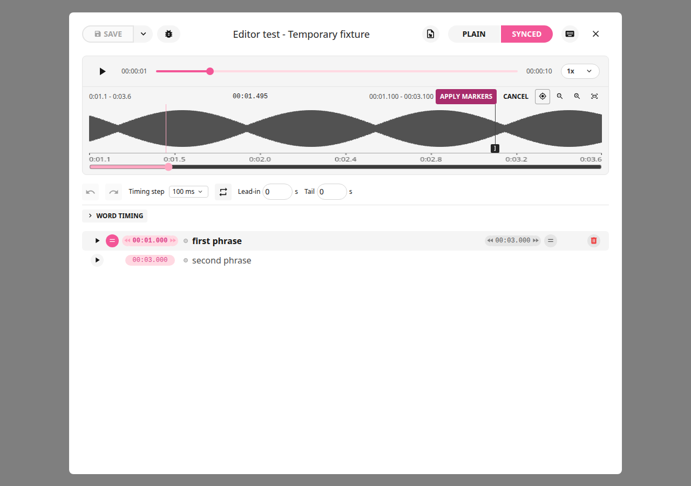

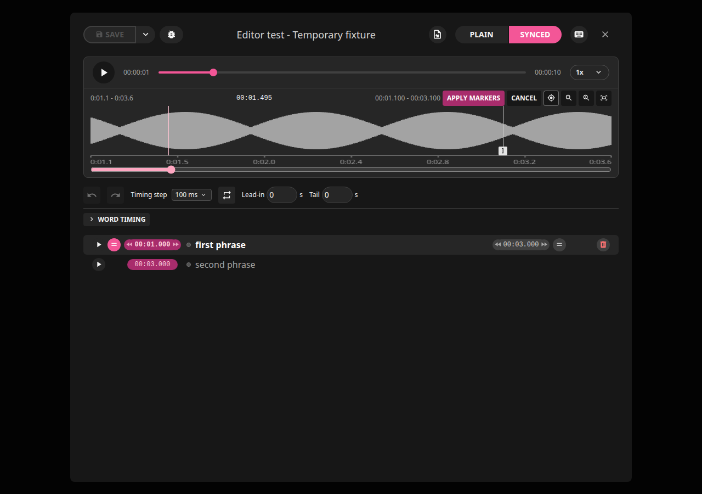

## Individual Words

**Follow Lyrics** is enabled initially when you open **Word timing**. During
normal playback the boxes advance to the current lyric, including backward
seeks. Selecting a row pins it; click **Follow Lyrics** to resume. Loops,
marker previews, word drags and text edits hold the selected line in place.
This changes the editing selection, not the recording or saved timestamps.

Expand **Word timing** and select a line. Use **Play** to listen, **Sync word**
to place the selected separator at the current playback position, and the
divider handles to refine word boundaries. The word lane has its own zoom and
scrolling; changing it does not zoom the waveform. **Reset** resets that line's
word timing, so use it only when you intend to rebuild those boundaries.
Collapse the word lane when you only need line-level timing.

To correct spelling, select a word box and click **Edit word**, press F2 or
right-click it. Edit the labeled field, then press Enter or the check button.
Escape or the cancel button discards the draft. This replaces one word while
preserving whitespace and timestamps; use explicit split/merge for structural
changes. Undo/Redo includes word corrections. Double-click still splits a word.
Plain and Synced are separate working versions: a synced correction does not
overwrite your Plain text or imported source file. Save and Export are explicit.

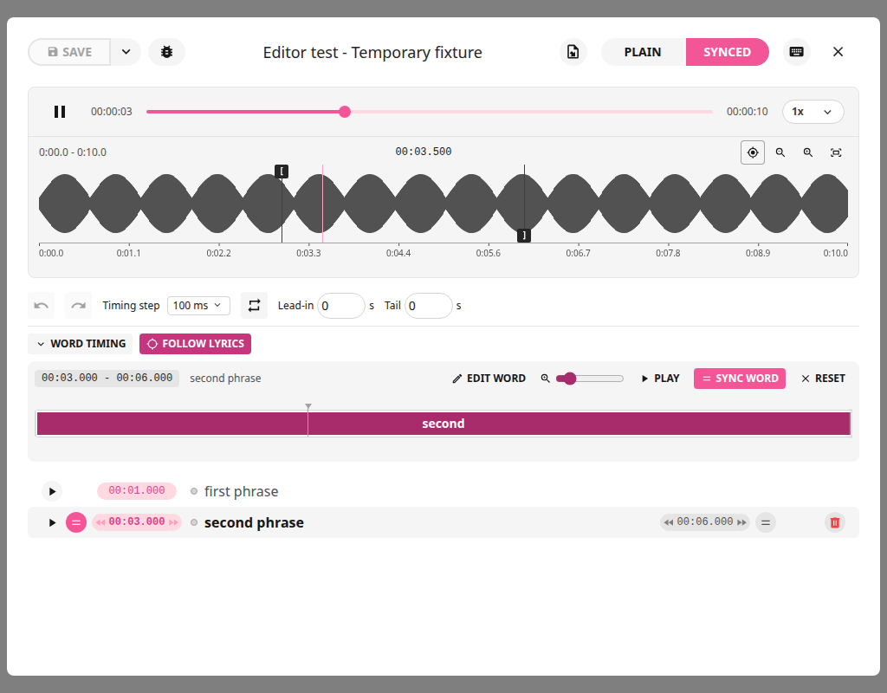

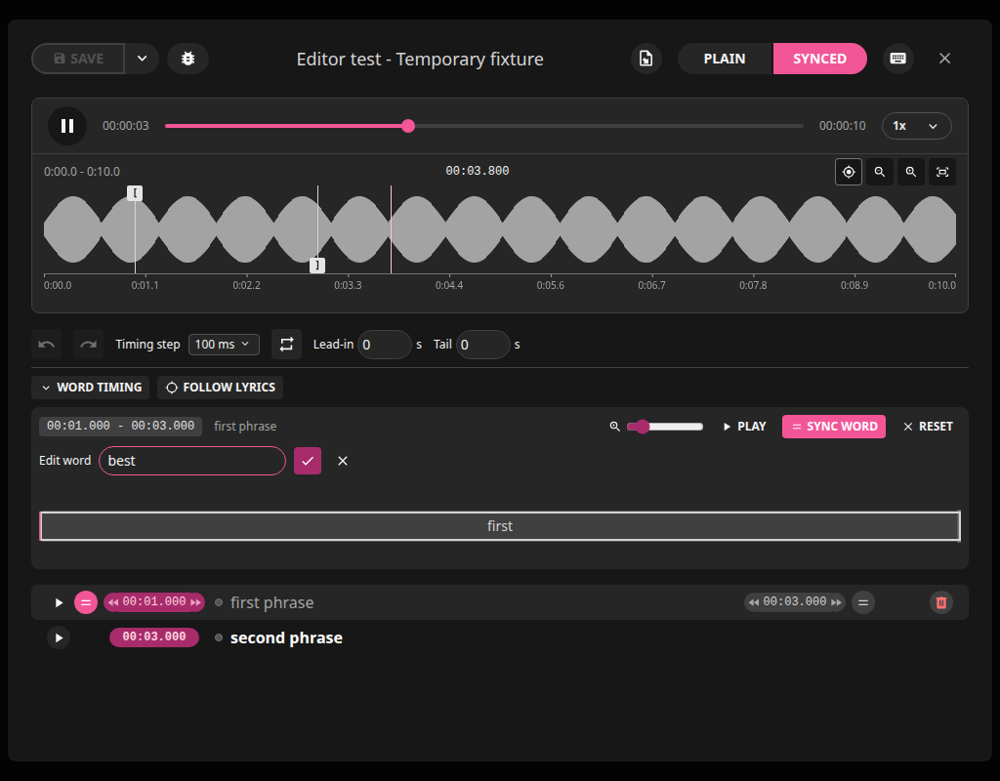

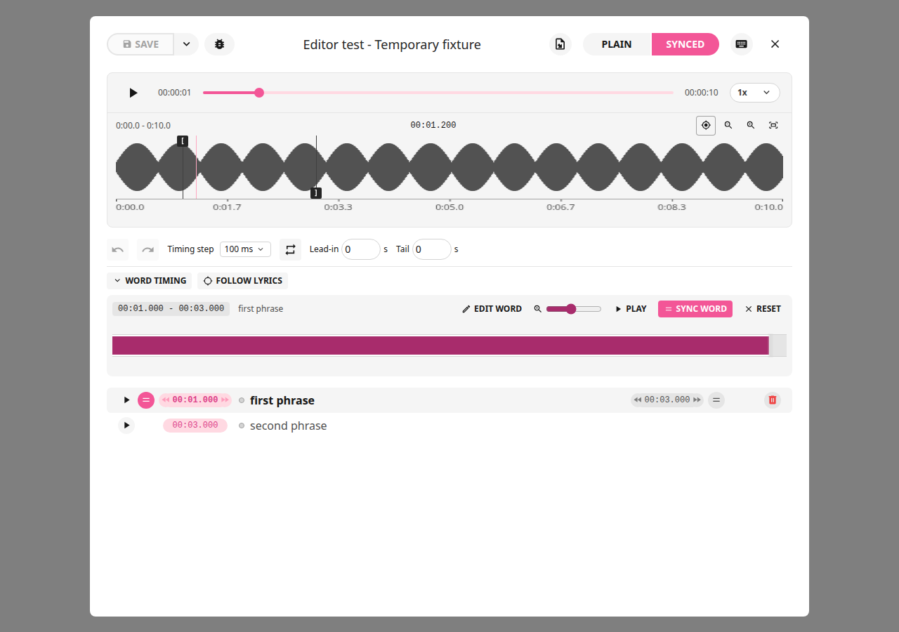

## Save, Export and Publish

Save retains the editor's changes. Use **Export** with **Synced lyrics (.lrc)**
selected to write a playback sidecar. Select embedded lyrics too if desired;
that option requires experimental embedding enabled and a supported audio file.
Embedding/exporting writes the track or sidecar; waveform navigation does not.

**Publish** sends lyrics to LRCLIB, with confirmation. Local saving/exporting
does not itself publish your lyrics. Player support for lyric display varies.

| Action | Result |
| --- | --- |
| Save | Retains edits in LRCGET's lyric document; does not itself export sidecars |
| Save and export: TXT | Writes plain lyrics beside the track |
| Save and export: LRC | Writes timed lyrics beside the track; selected initially |
| Save and export: Embed | Writes lyrics into supported audio metadata |
| Save and Publish | Uploads lyrics to the configured LRCLIB instance after confirmation |

TXT and LRC export coexist; exporting one does not delete the other. A chosen
format can replace its existing destination, so leave TXT unchecked to avoid
rewriting that TXT. Confirm waveform marker previews before saving/exporting.

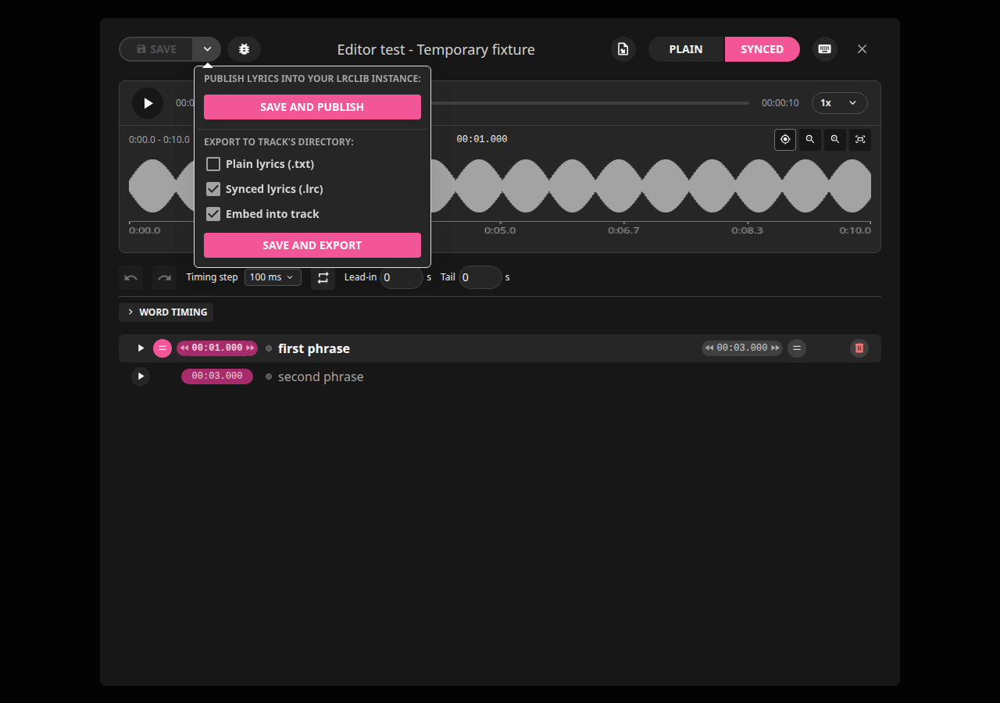

If **Embed into track** is disabled, enable experimental lyric embedding in
settings and check that the recording is supported. MP3 embedding uses ID3v2.4
UTF-8 USLT/SYLT, with milliseconds for synchronized words. Audio is not
re-encoded. Some car stereos, Windows players and Jellyfin clients cannot
display these lyrics; retaining the `.lrc` sidecar is still useful.

## Safe Saving

Exports stage and validate their output before atomically replacing a destination.
Failed preparation leaves the original untouched and removes temporary files.
Successful saves do not create `.bak` files; old `<filename>.lrcget.bak` files
for that exact destination are removed after a successful replacement. Unrelated
backups are not deleted. Embedded export needs space for one staged audio copy.
Keep separate backups if you need version history.
Read-only, symlink/non-file destinations and detected external edits can block
an export. Resolve the error and retry rather than assuming every target saved.

## Themes, Diagnostics and Limits

Select light or dark appearance in settings; waveform and timing controls follow
the theme. The bug icon opens the YAML document view for diagnostics. This view
is not an acoustic timing validator.

No separate WAV conversion is required. A waveform is decoded once and cached;
zoom, playback and theme changes reuse it. Changed files can rebuild the cache.
An unavailable waveform should not prevent text editing or normal playback.

For missing words, correct the trusted text manually. For a wrong recording,
choose the right audio before timing. For lyrics that do not appear in a player,
check that you exported LRC/embedded lyrics rather than only pressing Save,
and that the player supports the format. This app does not automatically detect
lead vocals, guarantee exact lip sync or run Whisper/Demucs.

## Current Views

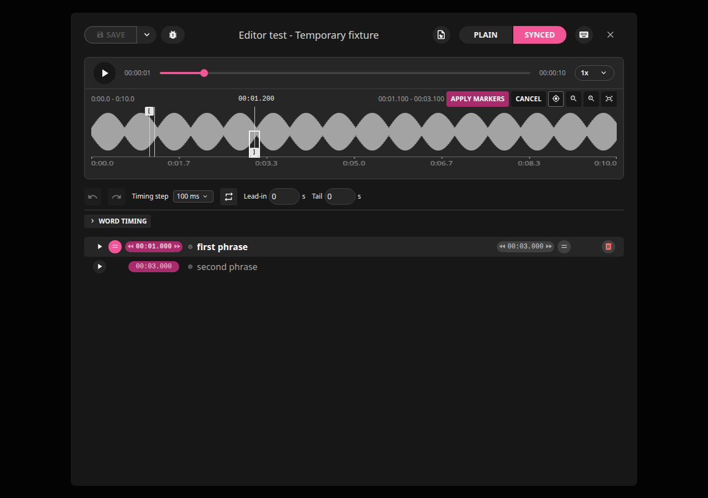

The preview timestamps above the waveform differ from the unchanged lyric-row
timestamps. Apply Markers confirms both; Cancel restores the original pair.

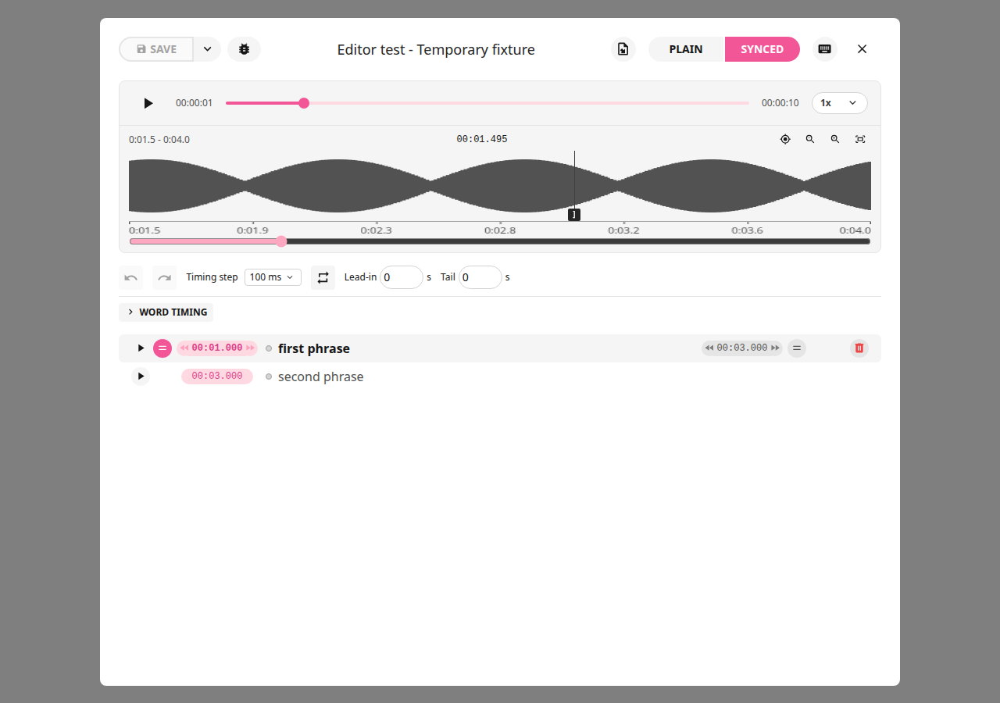

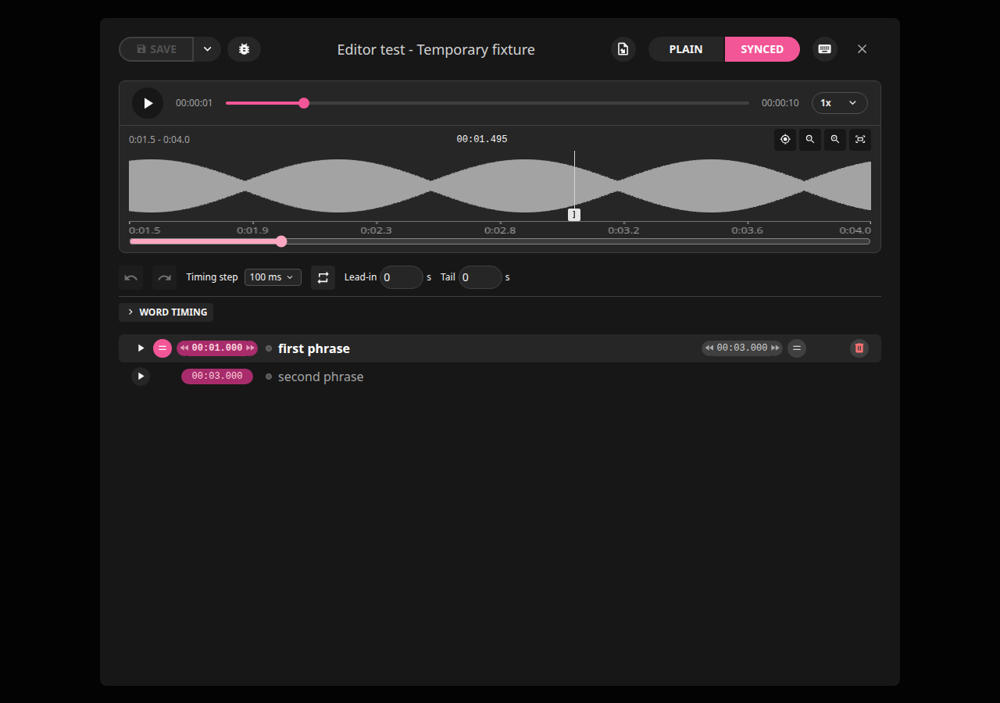

Screenshots were recaptured from .20 using temporary fixture lyrics and mocked waveform data, not private
music. A waveform shows the full mix; it is not proof of exact singer alignment.
