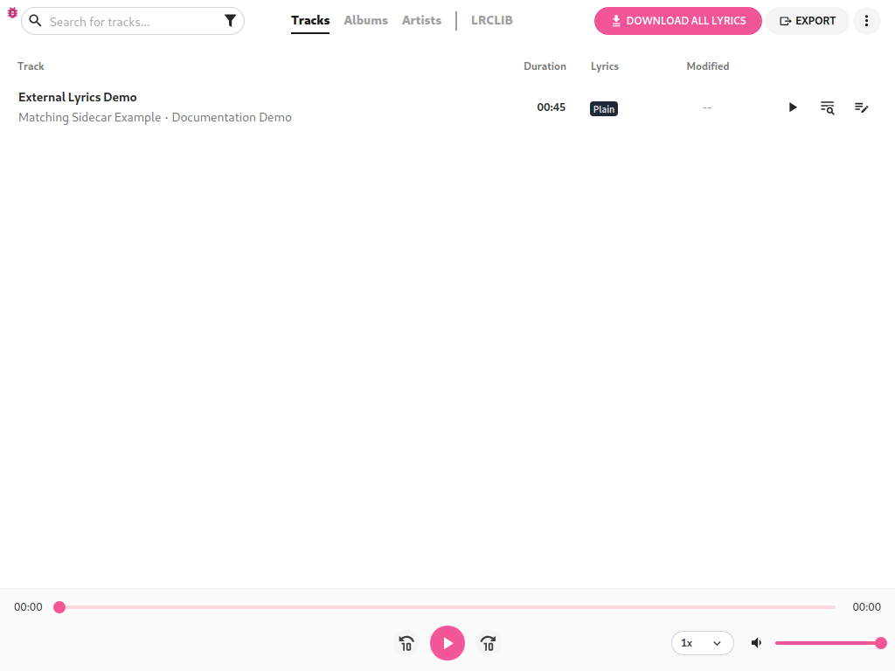
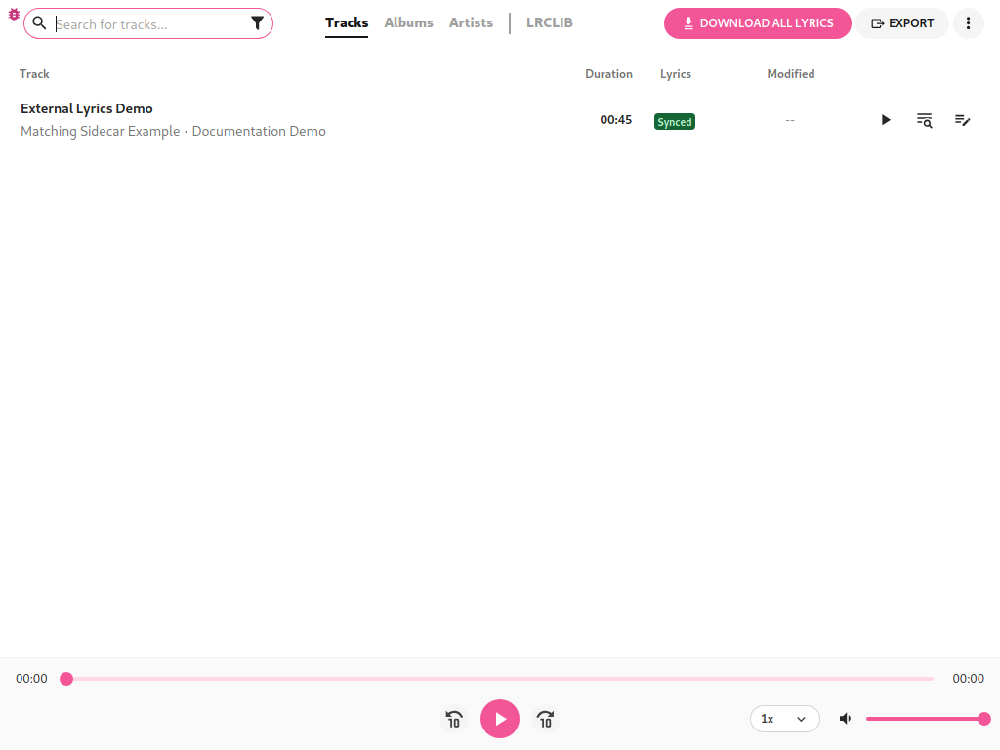
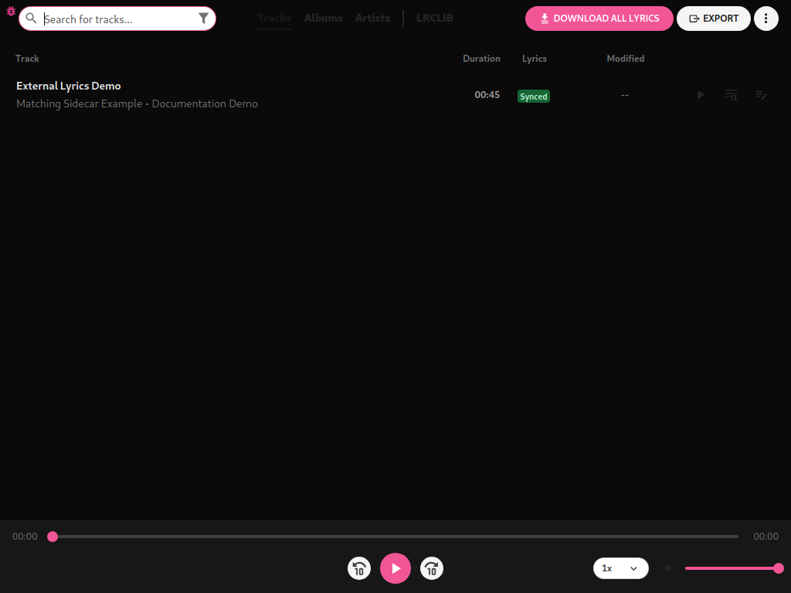
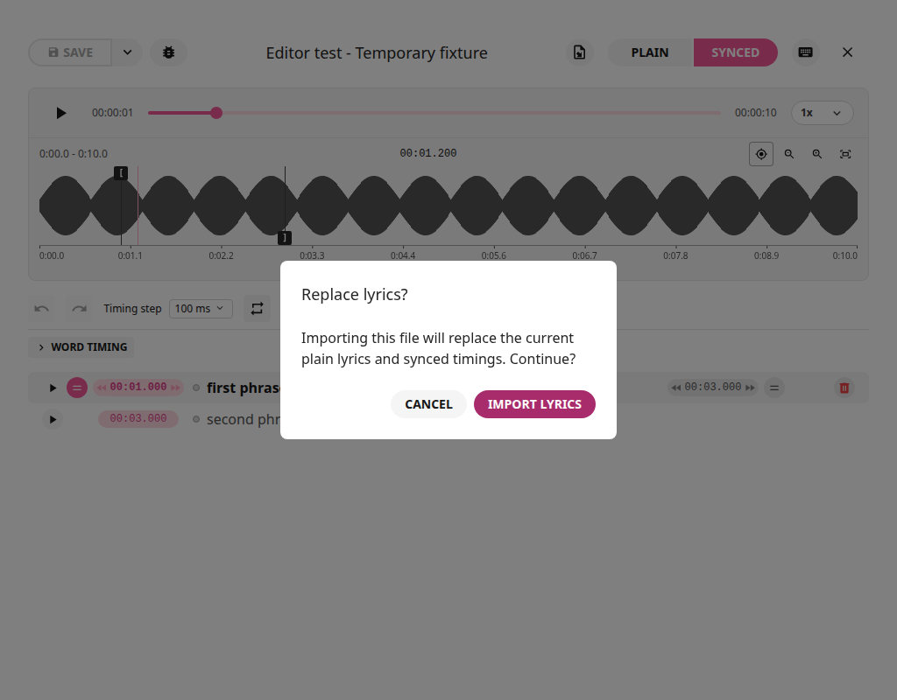
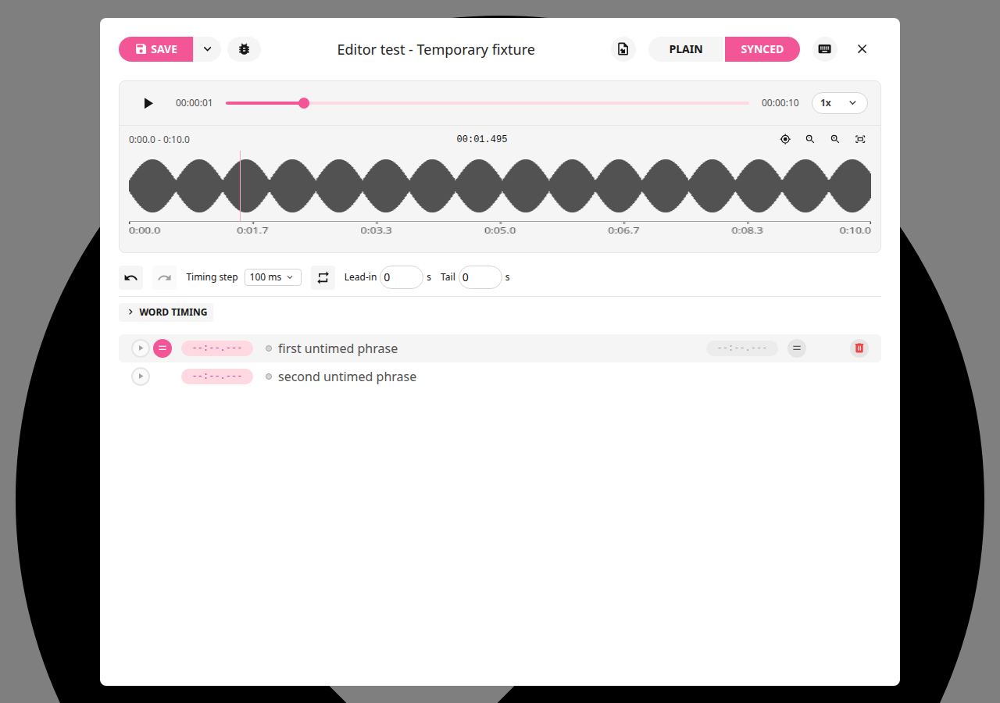
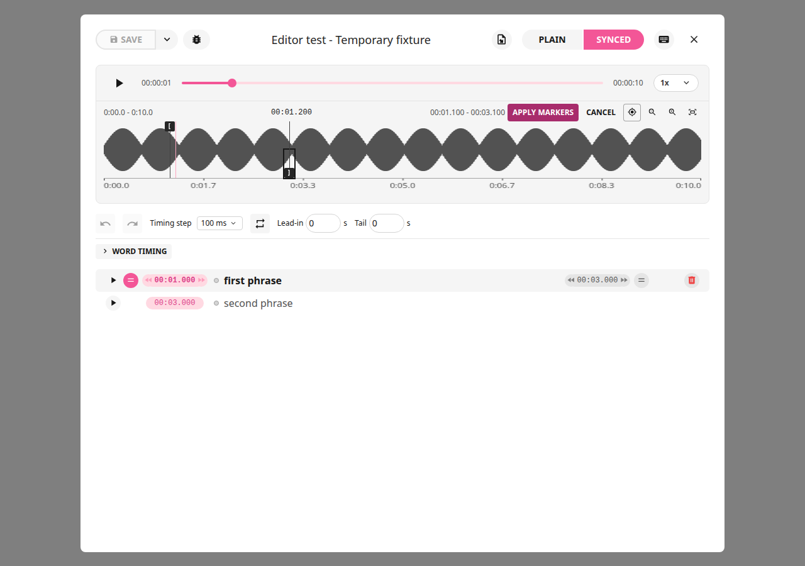
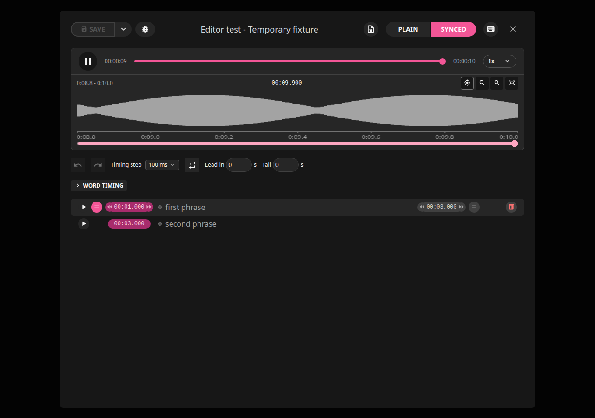
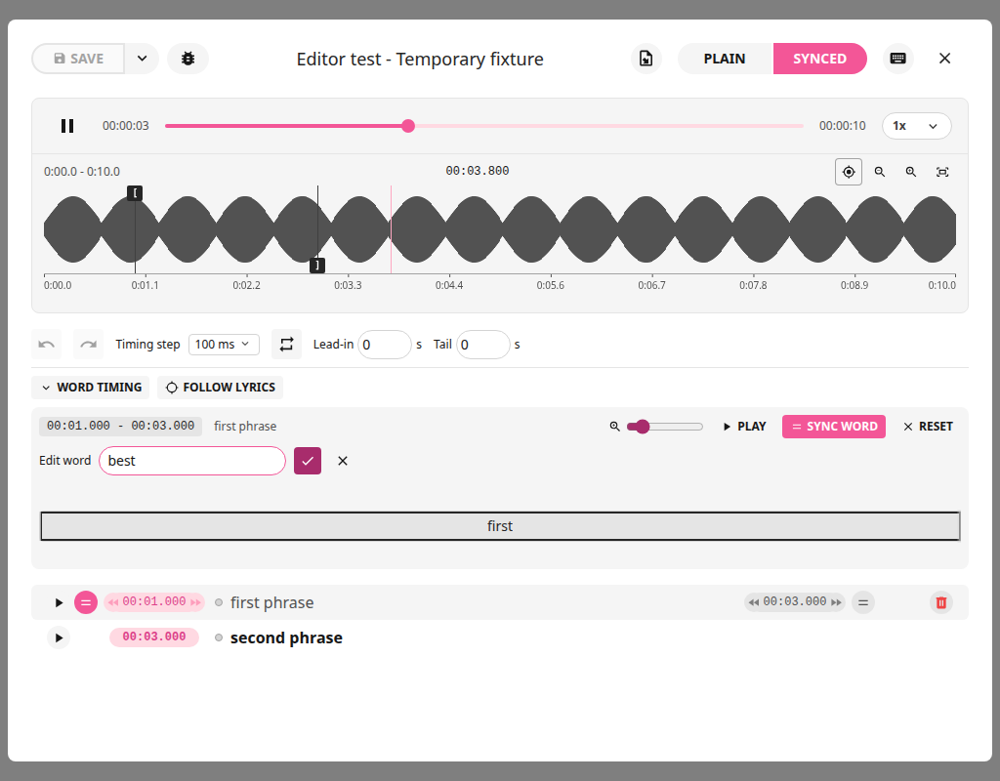
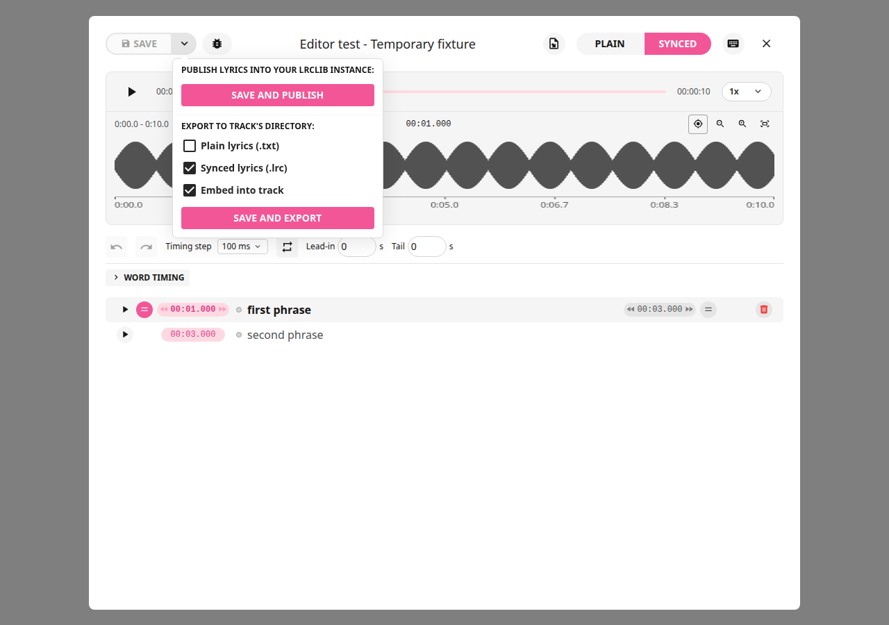
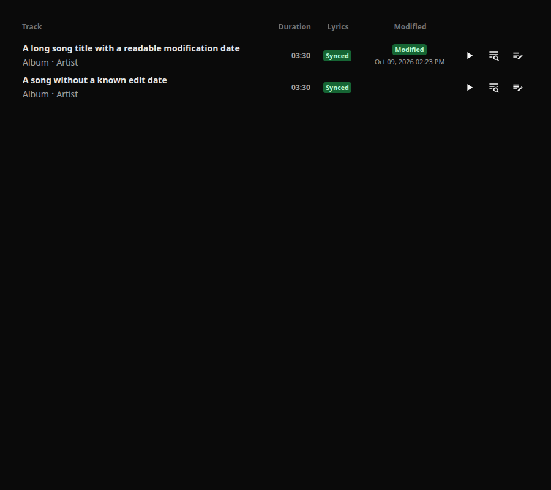

# Practical How-Tos

For Rick Lidgett's LRCGET **2.2.0+local.21**.
[Overview](app-overview.md) | [Full reference and shortcuts](editing-guide.md) | [Documentation home](README.md)

## Install or Upgrade

1. Download the `.deb` and checksum from the [current release](https://github.com/scriptusscript777/lrcget/releases/tag/v2.2.0-local.21).
2. Close LRCGET. In the directory containing the download, run:

```bash
sha256sum -c LRCGET_2.2.0+local.21_amd64.deb.sha256
sudo apt install ./LRCGET_2.2.0+local.21_amd64.deb
```

3. Reopen LRCGET and let its startup scan finish.

The package upgrades the existing installed application, not a second copy.
This fork release supplies Linux amd64; upstream installers for other platforms
do not contain these enhancements.

## Add Music and Refresh the Library

1. Add the directory containing your recordings using the library controls.
2. Wait for scanning to finish, then open a recording's lyrics editor.
3. After adding/removing recordings, close editing dialogs and press **F5**,
   or choose **Refresh library (F5)** in the library menu.

Refresh does not export or publish. When a recording has Plain or missing
lyrics, a valid matching LRC created by another application is picked up on
startup or F5. Its words take precedence over matching TXT; TXT fills missing
lyrics when no valid LRC exists. Already synced/instrumental lyrics are protected
and require explicit import to replace the working document.

Before: the matching TXT has been imported as Plain.



After closing the app, creating a valid matching LRC and reopening: Synced.
Neither recording nor sidecar is rewritten by the scan.





## Create Timed Lyrics From a Text File

1. Prepare a UTF-8 TXT with one sung phrase per line.
2. If copying from Genius, remove page credits, `[Verse]`/`[Chorus]` headings,
   contributor counts and other words that are not sung. LRCGET does not strip
   them or scrape a Genius URL for you.
3. Open the corresponding recording in the lyrics editor. Click **Import lyrics
   file**, select the TXT and confirm replacement if prompted.
4. The untimed rows open in **Synced**. Start audio with the main playback button;
   an untimed row's own Play button is unavailable until its start is set.
5. Select the first row. Press **Space** when that phrase begins; press
   **Shift+Space** when it ends. Select the next row and repeat.
6. Replay uncertain phrases, refine boundaries with zoom/markers, then Save and export LRC.

Use shortcuts outside text input fields. To paste instead of importing, paste
your words into **Plain**, switch to an empty **Synced** editor and choose
**Import from plain lyrics**. No automatic speech alignment is performed.



Your source TXT remains unchanged. The working Plain and Synced versions are
separate; editing synced text does not silently edit Plain or the source TXT.



## Edit an Existing LRC or Timed Text File

1. Open the correct recording, not another mix/remaster with different timing.
2. Choose **Import lyrics file** and select its LRC or timestamped TXT.
3. Confirm replacement only when you want to replace the current document.
4. Select a synced line. Double-click its wording to correct it, or change its timestamps.
5. Listen to the start, last sung word and transition into the following line.
6. Save, then export LRC if you want the sidecar updated.

Import reads the source; export is the action that can overwrite an existing
destination. Leave TXT export unchecked to retain your original TXT. For
enhanced inline word tags or nonzero offset headers, convert to explicit
line timestamps before importing.

## Find Lyrics Online

1. Search LRCLIB from LRCGET's library/search workflow.
2. Compare title, artist and recording duration before selecting a result.
3. Load the result and listen against your own audio. Plain lyrics need manual timing.
4. If no suitable result exists, copy trusted sung words into a TXT and use the text-file workflow.

Downloaded timing is not proof of a matching recording. This editor does not
automatically create missing words with Whisper or separate vocals with Demucs.

## Place Precise Markers and Preview Before Confirming

1. In Synced, select a timed lyric. Its start/end markers appear on the waveform.
2. Pause and zoom around the boundary. Use the upper handle for start and lower
   handle for end; each has one vertical guide.
3. Drag a handle, or focus it and nudge with Left/Right using the chosen timing
   step. Shift makes a marker nudge ten times larger.
4. Replay or loop the preview. The preview clock changes, but the lyric row is
   unchanged until confirmation.
5. Click **Apply Markers** to commit both boundaries as one undoable edit.
   Click **Cancel** to retain the original pair.



Escape during dragging cancels that drag; otherwise it cancels the preview.
Changing phrases or closing discards unconfirmed previews. Apply before Save/export.
For untimed text, first assign the line start; the provisional end says **Inferred
end** until you explicitly set or confirm it.

## Zoom and Follow Without Looping

1. Turn **Loop selected phrase** off for continuous playback.
2. Enable the crosshair **Follow waveform playback** button above the waveform.
3. Use Zoom in or double-click a waveform point repeatedly.
4. Continue playing: the viewport advances when needed, retaining magnification.
5. For fixed-region editing, pause, turn Follow off or pan manually.



Zoom does not disable Follow. Manual panning temporarily holds the view;
pause/play or the crosshair resumes following. An explicitly disabled Follow
stays disabled until you enable it. Use the wheel, trackpad or bottom pan slider
to reach off-screen markers. Zoom and scrolling never change marker timestamps.

**Follow Lyrics** is a separate control: it selects the active lyric/word boxes.
Use waveform Follow for viewport movement, Follow Lyrics for editing selection.

## Loop Between the Markers

1. Select a timed lyric and enable **Loop selected phrase**.
2. Set **Lead-in** and **Tail** to zero for exact marker-to-marker repetition.
3. Move/release marker previews to audition the revised range.
4. Apply the pair when satisfied; Cancel restores saved bounds.
5. Turn Loop off to keep playing forward.

Lead-in/Tail add context to playback, not the saved lyric timestamps. Changing
selected lines turns Loop off. Clicking a sentence's Play button also turns it
off and plays forward from that phrase. Timing-edit auditions can retain Loop.

## Edit Individual Words

1. Select a timed row and expand **Word timing**.
2. Use its separate zoom/scrolling to inspect individual word boundaries.
3. Select a word/separator, use **Sync word** at playback or drag its divider,
   then listen again. The lane's zoom does not change waveform zoom.
4. To correct spelling, select its box and use **Edit word**, F2 or right-click.
5. Press Enter/check to apply or Escape/cancel to discard the wording draft.



Spelling changes retain whitespace/timing. Use explicit split/merge for structure.
Double-click splits a word. Reset deliberately rebuilds that line's word timing;
do not use it merely to close the tools. Undo/Redo restores synced edits within
the session. Moving the first word start may also move the sentence start.

## Save and Export for Playback

1. Apply any pending marker previews.
2. Click **Save** to retain the local lyric document.
3. Open the arrow next to Save. Select **Synced lyrics (.lrc)** to write a timed
   sidecar. Select Plain TXT only if you also want that destination rewritten.
4. Optionally select **Embed into track** for supported MP3/FLAC files.
5. Click **Save and export** and check the result for each selected target.



If embedding is grayed out, enable experimental embedding in Settings and check
the file type. The supported output is MP3 ID3v2.4 USLT/SYLT or FLAC metadata;
audio is not re-encoded. Some players do not display embedded lyrics even when
the tags are valid. Keep/export the LRC sidecar as needed.

Save alone does not write an LRC or embed lyrics. Export does not publish online.
TXT and LRC coexist; one is not deleted by exporting the other. Successful saves
leave no new `.bak` files. Old app-owned backups for that saved destination are
removed when permitted. Failed staging preserves the original. No version history
is retained automatically; keep your own backups when needed.

## Publish Lyrics for Other Users

1. Confirm wording/timing against the exact recording.
2. Open the Save arrow and choose **Save and Publish**.
3. Review the publication details and confirmation for the configured LRCLIB instance.
4. Publish only lyrics you intend to share.

This is different from local saving/exporting. Other LRCLIB clients can discover
published lyrics, subject to the service's availability/search behavior. The
publication uploads lyric data, not your audio file or this app's installer.

## Check Modified Dates

1. Change a lyric word or timestamp, then explicitly Save.
2. Return to the library: **Modified** appears after Lyrics with local date/time.
3. Restart or refresh; the saved date remains.



Opening a song or saving unchanged content does not update the date. Unknown
historical dates show `--`. Creating a new timeline from your plain text and
saving it counts as a modification, just like editing an existing timed lyric.
Embedding changes the file fingerprint but now keeps
the track identity/date. Matching orphaned dates from older scans are repaired
without rewriting the current lyrics; ambiguous matches are not guessed.

## Troubleshooting

| Symptom                               | What to Check                                                                                   |
| ------------------------------------- | ----------------------------------------------------------------------------------------------- |
| Playhead leaves the zoomed view       | Enable waveform Follow; manual panning holds inspection; double-click zoom now preserves Follow |
| Markers do not advance with sentences | Enable Follow Lyrics; manual selection, edits and loops pin the target                          |
| Audio stops/repeats at a marker       | Turn Loop off; sentence Play starts forward playback                                            |
| No markers or row playback for TXT    | Assign its start first; untimed text has no real timestamps yet                                 |
| End says Inferred end                 | Set end at playback or confirm the intended pair with Apply Markers                             |
| Lyrics do not show in another player  | Export LRC/embed, rather than only Save; verify that player's format support                    |
| An external LRC edit is absent        | Reopen or press F5 to upgrade missing/Plain lyrics from a valid matching LRC. Already synced lyrics require explicit import to protect saved edits. |
| Save is disabled or date unchanged    | No unsaved document changes; import/timing/text edits must be saved                             |
| Embedded option is disabled           | Experimental embedding setting and supported file type                                          |
| Export partly failed                  | Review each target; successful targets may already be written; fix permissions/path and retry   |
| Waveform is unavailable               | Use Retry; text editing/basic playback remain separate from waveform availability               |
| Hover help seems delayed              | Descriptions use native titles; the browser controls their delay                                |

Screenshots use temporary demonstration fixtures. Detailed keyboard bindings,
format limits and safety behavior are in the [editing reference](editing-guide.md).
